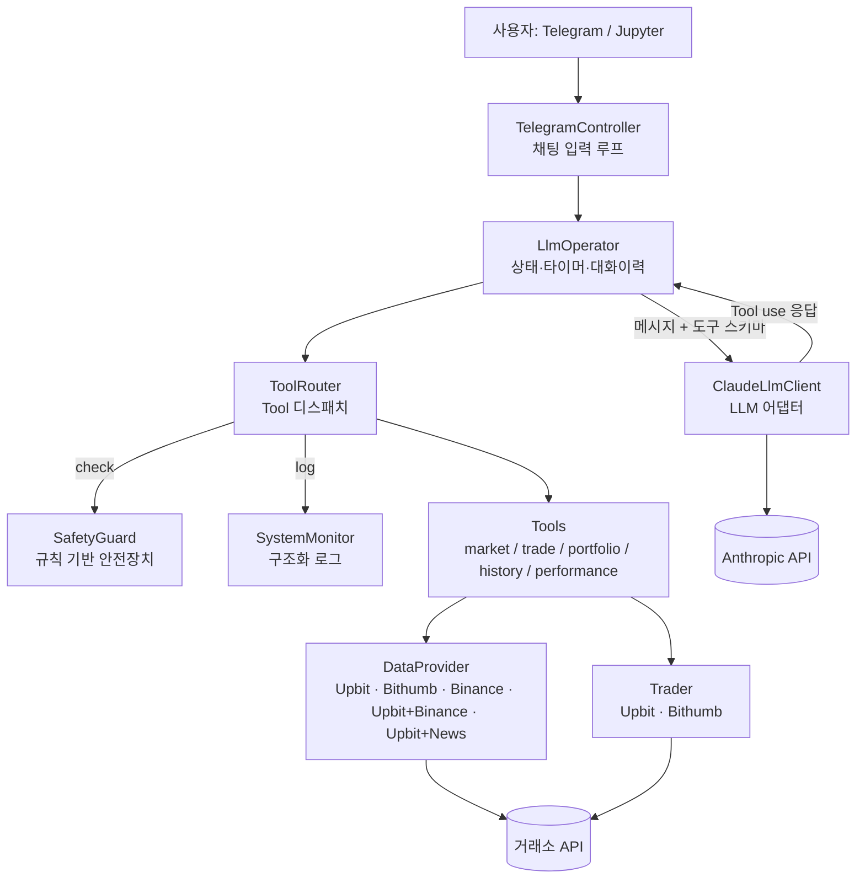
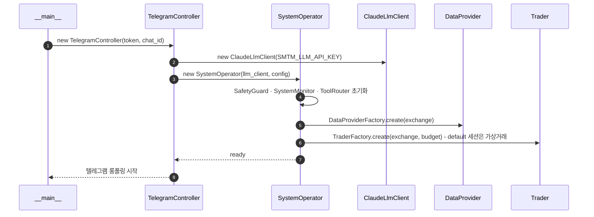
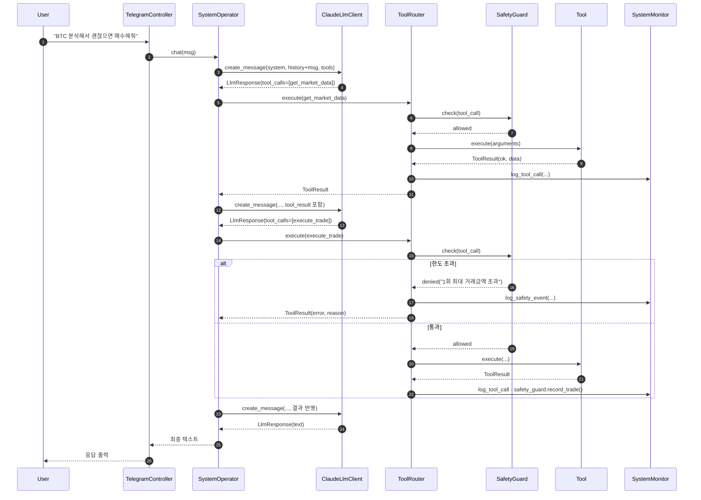
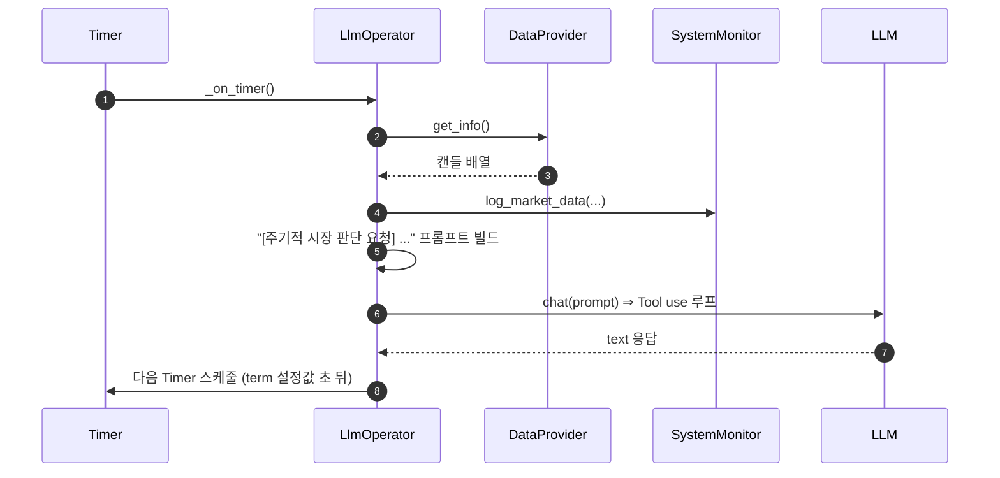

# smtm — Architecture

smtm의 시스템 구조·핵심 플로우·확장 포인트를 개요 수준으로 정리한 문서입니다. 구현 세부(함수 시그니처 등)는 코드(`smtm/`) 또는 `docs/wiki/architecture.md`를 참조하세요.

- 최종 갱신일: 2026-04-20
- 기준 버전: 1.7.1

---

## 1. System Overview

### 1.1 컴포넌트 구성



### 1.2 레이어

| 레이어 | 책임 | 구성 요소 |
|--------|------|-----------|
| Presentation | 사용자 입력·출력 | `TelegramController`(유일한 실행 진입점), `JptController`(노트북 전용) |
| Orchestration | 상태·타이머·대화 흐름 | `LlmOperator`, `Worker`(백그라운드 실행기) |
| LLM 어댑터 | 벤더 API 추상화 | `LlmClient` (추상), `ClaudeLlmClient` (구현) |
| Safety | Tool 실행 직전 한도 검사 | `SafetyGuard`, `SafetyConfig` |
| Tool 계층 | LLM이 호출 가능한 능력 | `ToolRouter`, `tools/*` |
| Integration | 시장 데이터 / 주문 실행 | `DataProvider` 8종 (UPB · BTH · BNC · UBD · UPN · UMN · USC · UFC) + 신호 빌딩 블록 (크립토 뉴스 NWS·CTN·DCN·CSN·BMN·TBN·MNS / 경제 뉴스 WSJ·MWN·CNB / 소셜 RDT·RCC·RBT·HNS / 감정 FGI / 가격 CGK·CCP·CGL / 전통시장 YFN / 온체인 BCI·MPF·EGS / 파생·포지셔닝 BFR·BOI·BLS / 공지 UPT / 환율 FXR), `Trader` 2종 (+ Factory) |
| Observability | 로그·모니터링 | `LogManager`(파일 로그), `SystemMonitor`(인메모리 구조화 로그) |

---

## 2. 기술 스택

| 영역 | 스택 |
|------|------|
| 언어 | Python 3.9+ |
| LLM | Anthropic Claude (`claude-sonnet-4-20250514`), SDK `anthropic>=0.25` |
| HTTP | `requests>=2.28` |
| 인증 (거래소) | `pyjwt>=2.0` (서명), 환경변수 기반 API 키 |
| 설정 | `python-dotenv` |
| 동시성 | `threading.Timer`(주기 틱), `Worker`(백그라운드 실행 큐) |
| 로그 | 표준 `logging` + `RotatingFileHandler` (2MB × 10) |
| 테스트 | `pytest` (unit / e2e / integration) |

---

## 3. 핵심 자료 구조

### 3.1 대화 메시지

`LlmOperator.conversation_history`는 다음 형태의 리스트입니다.

- `{"role": "user", "content": str}`
- `{"role": "assistant", "content": [TextBlock | ToolUseBlock, ...]}`
- `{"role": "user", "content": [ToolResultBlock, ...]}`  (Tool 결과는 `user` 롤로 다시 투입)

상한은 `max_conversation_turns * 2`(기본 100)이며 초과분은 오래된 것부터 제거됩니다.

### 3.2 LlmResponse

```python
@dataclass
class LlmResponse:
    text: str                  # 자연어 응답 합친 것
    tool_calls: list[ToolCall] # 도구 호출 목록
    stop_reason: str           # "end_turn" | "tool_use" | ...
    usage: dict                # {input_tokens, output_tokens}
```

### 3.3 SafetyConfig

| 필드 | 기본값 | 단위 / 의미 |
|------|--------|-------------|
| `max_trade_amount` | 100,000 | KRW, 1회 거래 최대 금액 |
| `max_daily_trades` | 20 | 하루 거래 횟수 상한 |
| `max_loss_ratio` | -0.20 | 누적 손실률 하한 (-20%) |
| `initial_budget` | 세션의 `budget` 설정값 | 손실률 계산 기준 |

### 3.4 DataProvider 다형 데이터 계약

`DataProvider.get_info()`는 수치형과 텍스트형 데이터를 한 리스트에 섞어 반환할 수 있습니다. 각 딕셔너리는 `type` 키로 자기 스키마를 알립니다.

| `type` | 종류 | 주요 필드 | 예시 Provider |
|--------|------|----------|--------------|
| `primary_candle` | 주거래 캔들 (필수) | market, date_time, OHLCV, acc_price, acc_volume | Upbit / Bithumb / Binance |
| `binance` | 보조 거래소 캔들 | market, date_time, OHLCV | UpbitBinanceDataProvider |
| `price_snapshot` | 종합 가격 스냅샷 | prices, market_cap_usd, volume_24h_usd, change_24h_pct | CoinGeckoDataProvider |
| `onchain_stats` | 온체인 네트워크 통계 | hash_rate_ghs, difficulty, n_tx_24h, miners_revenue_usd, ... | BlockchainInfoDataProvider |
| `mempool_fees` | BTC 수수료 권장값 | fastest_fee, half_hour_fee, hour_fee, economy_fee, minimum_fee (sat/vB) | MempoolFeesDataProvider |
| `eth_gas` | ETH 가스 권장값(gwei) | safe_gas_price, propose_gas_price, fast_gas_price, suggest_base_fee | EtherscanGasDataProvider |
| `funding_rate` | 선물 펀딩비 | symbol, funding_rate, funding_rate_pct, mark_price, index_price | BinanceFundingRateDataProvider |
| `open_interest` | 선물 누적 미결제약정 | symbol, period, open_interest_contracts, open_interest_notional_usd | BinanceOpenInterestDataProvider |
| `long_short_ratio` | 선물 롱/숏 계정 비율 | symbol, period, scope, long_short_ratio, long_account_pct, short_account_pct | BinanceLongShortRatioDataProvider |
| `exchange_rate` | 환율 | base, rates, date_time | ExchangeRateDataProvider |
| `macro_market` | 전통시장/매크로 지수 | symbol, label, price, previous_close, change_24h_pct, currency, exchange | YahooFinanceDataProvider |
| `crypto_global` | 전체 크립토 시장 거시 | total_market_cap_usd, total_volume_24h_usd, btc/eth/stablecoin_dominance_pct, market_cap_change_24h_pct | CryptoGlobalDataProvider |
| `sentiment_index` | 감정 지수(0~100) | date_time, source, index_name, value, classification | FearGreedDataProvider |
| `news` | 뉴스 기사 | date_time, source, title, summary, url | NewsDataProvider · CoinTelegraph · Decrypt · CryptoSlate · BitcoinMagazine · TheBlock · WSJMarkets · MarketWatch · CNBCFinance · MultiNewsDataProvider · UpbitNewsDataProvider · UpbitMultiNewsDataProvider |
| `reddit` | 서브레딧 게시물 | date_time, source, title, summary, url, author | RedditDataProvider · CryptoCurrencyRedditDataProvider · BitcoinRedditDataProvider |
| `hackernews` | HN 스토리 | title, url, author, points, num_comments, date_time | HackerNewsDataProvider |
| `notice` | 거래소 공지 | date_time, source, title, body, url, category | UpbitNoticeDataProvider |

새 데이터 유형을 추가할 때는 계약만 지키면 됩니다. 소비자(LLM)가 리스트의 각 항목을 `type`별로 해석하므로 기존 Tool 스키마를 깨지 않고도 다양한 신호를 주입할 수 있습니다. 이미지 같은 multimodal 블록 지원은 로드맵 항목입니다([`release-notes.md`](release-notes.md#roadmap)).

내장된 모든 Provider의 **엔드포인트 · 필드 · 인증 · Rate Limit**은 [`data-providers.md`](data-providers.md)에 카탈로그로 정리돼 있습니다.

### 3.5 SystemMonitor 로그 종류

| 로그 | 내용 |
|------|------|
| `market_data_log` | 각 틱에 조회된 캔들 배열 |
| `tool_call_log` | 모든 Tool 호출의 입력·결과 |
| `trade_request_log` / `trade_result_log` | 주문 요청·응답 |
| `llm_interaction_log` | LLM 요청·응답·토큰 사용량 |
| `safety_event_log` | 차단 이벤트 (`{type, tool, reason}`) |
| `snapshots` | 포트폴리오 스냅샷 |

현재는 **인메모리**입니다. 디스크 영속화는 [release-notes의 로드맵](release-notes.md#roadmap)에 등록돼 있습니다.

---

## 4. 주요 플로우

### 4.1 부팅 — `python -m smtm --token <bot_token> --chatid <chat_id>`



`default` 세션은 항상 가상거래(`virtual: true`)로 생성됩니다. 실거래 세션은 사용자가 채팅으로 계좌를 등록하고 `virtual: false` + `account` 프로파일로 `create_session`을 요청해야만 만들어집니다.

### 4.2 사용자 메시지 처리



### 4.3 자동 매매 틱



### 4.4 한도 초과 시 재판단

- SafetyGuard가 `execute_trade`를 거부하면 LLM에게 실패 Tool 결과가 전달됩니다.
- LLM은 해당 사유를 받아 **주문 금액 축소, 취소, 관망** 중 하나를 선택합니다.
- 사용자에게는 최종 텍스트만 보입니다(차단 사유는 `safety_event_log`에만 남음).

---

## 5. 확장 포인트

### 5.1 새 거래소 추가

1. `smtm/data/<name>_data_provider.py`에서 `BaseDataProvider` 상속, `CODE` / `NAME` / `get_info()` 구현.
2. `smtm/trader/<name>_trader.py`에서 `BaseExchangeTrader` 상속, `send_request()` / `get_account_info()` 구현.
3. 각 Factory 리스트(`DataProviderFactory.DataProvider_LIST`, `TraderFactory.TRADER_LIST`)에 추가.
4. README `Supported Exchanges` 표 갱신.

### 5.2 새 Tool 추가

1. `smtm/llm/tools/<name>_tool.py`에서 `Tool` 상속, `name` · `description` · `input_schema` · `execute()` 정의.
2. `LlmOperator.setup_tools()`에서 `self.tool_router.register(MyTool(...))` 호출.
3. 안전하게 차단하고 싶다면 `SafetyGuard.TRADE_TOOLS`에 이름을 추가.

### 5.3 새 LLM 벤더 추가

1. `smtm/llm/<vendor>_llm_client.py`에서 `LlmClient` 상속.
2. `create_message(system_prompt, messages, tools)` 구현. 반환값은 `LlmResponse`로 정규화.
3. 벤더별 Tool use 응답 포맷을 `ToolCall` 리스트로 변환해야 함.
4. `TelegramController` 생성 부분에서 `ClaudeLlmClient` 대신 해당 어댑터 인스턴스화.

### 5.4 SafetyConfig 사용자 설정

세션별 한도는 프로파일의 `safety` 설정값(채팅으로 지정)으로 조정합니다. 기본값 자체를 바꾸려면 `SystemOperator` 생성 시 `config["safety"]` dict로 주입합니다.

```python
config = {"budget": 1_000_000, "safety": {"max_daily_trades": 10}}
operator = SystemOperator(client, config)
```

---

## 6. 보안

- 모든 API 키(LLM, 거래소, 텔레그램)는 환경변수로만 받습니다. 코드·파일 로그·예외 메시지에 노출되지 않습니다.
- 텔레그램 봇은 지정 `chat_id`만 처리합니다(그 외 메시지는 즉시 폐기).
- 거래 Tool은 `SafetyGuard.check()`를 거치지 않고는 실행될 수 없습니다 (`ToolRouter`가 단일 진입점).
- 시크릿은 `.env`에만 두고 `.gitignore`로 커밋을 차단해야 합니다(저장소의 `.gitignore` 참고).

---

## 7. 관찰 가능성

### 7.1 파일 로그

- 경로: `log/smtm.log`
- 포맷: `YYYY-MM-DD HH:MM:SS LEVEL  name       lineno - message`
- 회전: 2MB 단위, 최대 10개 (`smtm.log.1` ~ `.10`)
- 스트림(stdout) 레벨은 `Config.operation_log_level`로 조절.

### 7.2 SystemMonitor

- 인메모리 구조화 로그 (§3.5).
- `get_llm_usage()` — 누적 입/출력 토큰 및 호출 횟수.
- 디스크 영속화는 [후속 과제](release-notes.md#roadmap).

---

## 8. 배포 / 운영 개요

- **실행 단위**: 단일 Python 프로세스. 텔레그램 챗봇이 유일한 진입점 (`python -m smtm --token <bot_token> --chatid <chat_id>`).
- **장기 구동**: `nohup` / `tmux` / `screen` 또는 systemd 유닛 권장 (공식 제공 스크립트는 없음).
- **리소스**: 메모리 수백 MB 이내. LLM 호출이 주요 외부 비용이고 CPU는 대부분 유휴.
- **네트워크**: 거래소 API(HTTPS), Anthropic API(HTTPS). 외부에서 들어오는 포트는 없음 (텔레그램은 아웃바운드 롱폴링).
- **데이터**: 영속 상태 없음. 재시작 시 대화 이력 / 일일 거래 카운터 / SystemMonitor 로그 모두 초기화.

---

## 9. 내부 상세 문서

- 클래스 다이어그램: `docs/smtm_class.puml` → `smtm_class.png`
- 컴포넌트 다이어그램: `docs/smtm_component.puml`
- 시퀀스 다이어그램(한/영): `docs/smtm_sequence*.puml`
- 위키: `docs/wiki/architecture.md`, `docs/wiki/how-to-setup-and-run.md`, `docs/wiki/tips.md`
