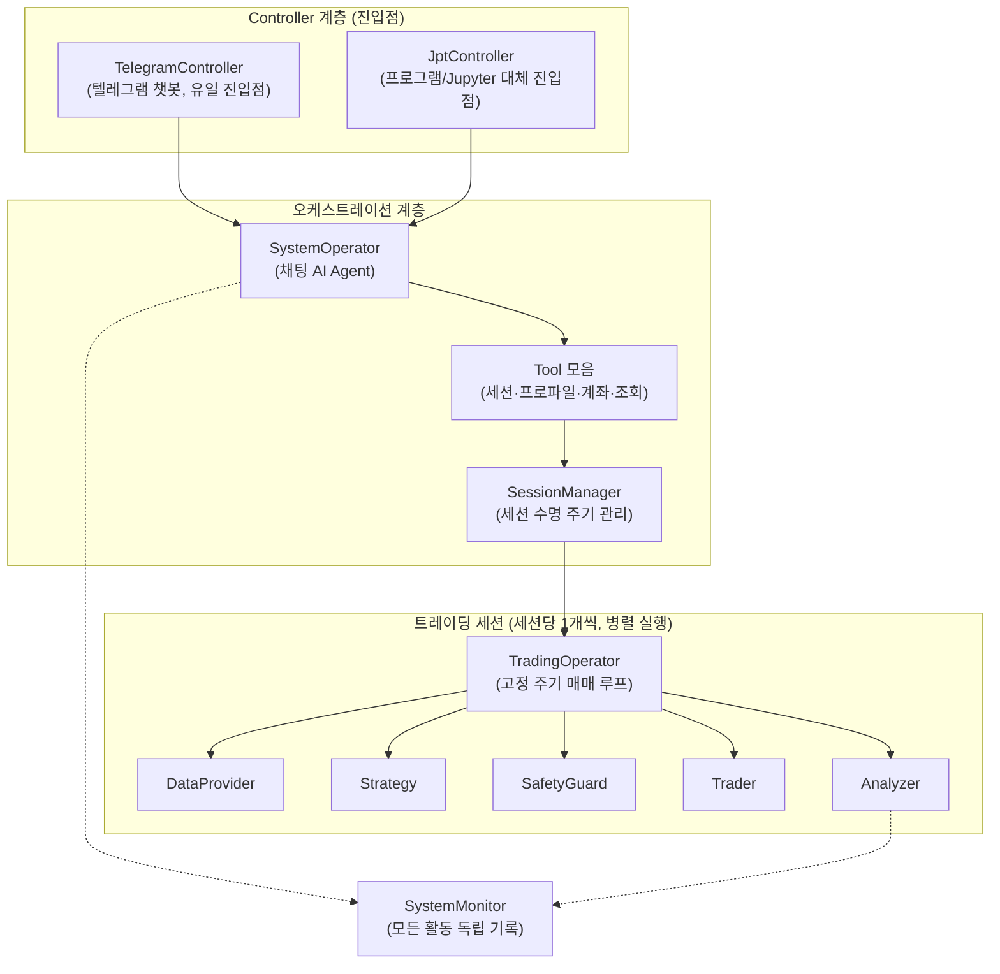

# SMTM 프로젝트 상세 문서

> 이 문서는 v2.0.0(AI Agent 아키텍처) 기준으로 작성되었습니다. 구 버전(1.x)의 룰 기반 아키텍처(시뮬레이터, 대량 시뮬레이션, 데모 모드 등)와는 구조가 다릅니다.

## 목차
1. [프로젝트 개요](#프로젝트-개요)
2. [전체 프로젝트 구조와 동작 원리](#전체-프로젝트-구조와-동작-원리)
3. [주요 모듈들의 세부 동작](#주요-모듈들의-세부-동작)
4. [개발 방법](#개발-방법)
5. [전략 추가 방법](#전략-추가-방법)

---

## 프로젝트 개요

**SMTM (Show Me The Money)** 은 파이썬으로 개발된 AI Agent 기반 자율 암호화폐 자동매매 시스템입니다.

채팅으로 제어하는 AI Agent가 시스템 전체를 오케스트레이션하고 — 계좌 등록, 프로파일 관리, 트레이딩 세션 생성/시작/중지 — 실제 매매는 각 세션이 자신의 고정 주기 루프에서 독립적으로 수행합니다. 시스템 제어 채널은 **텔레그램 챗봇 하나**이며, 봇을 띄운 뒤 모든 조작을 채팅으로 합니다.

### 핵심 특징
- **채팅 기반 오케스트레이션**: AI Agent(SystemOperator)와 대화하며 계좌 등록, 프로파일 관리, 세션 제어
- **텔레그램 전용 제어**: 유일한 진입점은 텔레그램 챗봇 — 예산·전략·거래소 등 설정도 모두 채팅으로 지정
- **2계층 아키텍처**: 오케스트레이션(SystemOperator)과 매매 실행(TradingOperator)의 명확한 분리
- **멀티세션 병렬 트레이딩**: 여러 전략을 여러 계좌·종목에서 동시에 운영하고 성과 비교
- **플러그블 매매 전략**: 알고리즘 전략(BNH, RSI, SMA)과 틱당 1회 LLM 판단 전략(LLM)
- **안전장치**: 모든 주문을 실행 전에 검증하는 SafetyGuard — AI Agent가 우회할 수 없음
- **가상거래(Virtual Trading) 기본값**: 프로세스와 함께 뜨는 `default` 세션은 가상거래 — 실시간 시세로 전략을 검증하되 실제 주문은 전송되지 않음

### 주요 기능
- 데이터 수집 → 전략 판단 → 안전장치 검증 → 거래 실행 → 분석의 반복 프로세스
- 다양한 거래소 지원 (Upbit, Bithumb 매매 / Binance 등 데이터 제공)
- 뉴스·소셜·온체인·매크로 지표 등 20여 종의 공개 데이터 소스 결합 가능
- 텔레그램 챗봇을 통한 원격 거래 제어 (프로그램/Jupyter 제어용 `JptController`도 별도 제공)

> 참고: 구 버전(1.x)에서 제공되던 과거 데이터 기반 시뮬레이션(백테스팅), 대량 시뮬레이션, 데모 모드, CLI 대화형 모드는 v2.0.0 재작성 과정에서 제거되었습니다. 전략 검증은 현재 가상거래(`default` 세션 또는 프로파일의 `virtual` 설정값)로 수행합니다.

---

## 전체 프로젝트 구조와 동작 원리

### 아키텍처 개요

SMTM은 **2계층 아키텍처**로 설계되어 있고, 두 계층 사이를 SessionManager가 연결합니다.



- **SystemOperator**는 채팅 기반 AI Agent로, Tool 호출을 통해서만 시스템을 제어합니다. **직접 매매하지 않습니다.**
- **SessionManager**는 모든 트레이딩 세션을 소유하고, 세션 생성 시 예산과 계좌 조건을 검증합니다.
- **TradingOperator**는 세션마다 1개씩 존재하며, 고정 주기(기본 60초)로 매매 파이프라인을 반복 실행합니다.

### 동작 원리

#### 1. 채팅 오케스트레이션 흐름
```
사용자 → TelegramController: 텔레그램 메시지 입력
TelegramController → SystemOperator: 메시지 전달
SystemOperator → LLM: 대화 + Tool 목록 제공
LLM → ToolRouter: Tool 호출 (예: create_session, start_session)
ToolRouter → SessionManager: 세션 생성/시작/중지 수행
SystemOperator → 사용자: 결과 응답
```

#### 2. 매매 틱 실행 흐름 (세션별, 고정 주기)

`TradingOperator._execute_trading()`이 매 주기마다 수행하는 파이프라인입니다.

```
TradingOperator → DataProvider: get_info() — 시장 데이터 수집
TradingOperator → Strategy: update_trading_info() — 거래 정보 업데이트
TradingOperator → Analyzer: put_trading_info() — 거래 정보 기록
TradingOperator → Strategy: get_request() — 매매 요청 생성
TradingOperator → SafetyGuard: check_request() — 요청별 안전장치 검증
TradingOperator → Trader: send_request() — 허용된 요청만 거래 실행
Trader → Strategy/Analyzer: 체결 결과 콜백 전달
```

- 안전장치에 걸린 요청은 실행되지 않고 `Analyzer.put_safety_event()`로 차단 사유가 기록됩니다.
- 가상거래 모드에서는 매 틱 최신 캔들 종가가 `SimulationTrader`에 주입되어 실시간 시세 기반으로 가상 체결됩니다.

### 핵심 컴포넌트 간 상호작용

1. **Controller 계층**: 사용자 인터페이스 제공
   - 텔레그램 챗봇 TelegramController (유일한 실행 진입점)
   - 프로그램/Jupyter Notebook용 JptController (대체 진입점)

2. **오케스트레이션 계층**: 시스템 운영 관리
   - SystemOperator: LLM과의 대화, Tool 라우팅
   - SessionManager: 세션 생성 검증, 병렬 세션 관리, 계좌 가드 공유

3. **트레이딩 세션**: 매매 실행 (세션당 1세트)
   - **DataProvider**: 시장 데이터 수집
   - **Strategy**: 매매 전략 판단
   - **SafetyGuard**: 주문 실행 전 검증
   - **Trader**: 실제(또는 가상) 거래 실행
   - **Analyzer**: 성과 분석

4. **SystemMonitor**: 시장 데이터, 요청/결과, 안전 이벤트, LLM 사용량을 세션 이름 태그와 함께 독립적으로 기록

---

## 주요 모듈들의 세부 동작

### 1. SystemOperator 모듈 (`smtm/llm/system_operator.py`)

**역할**: 채팅 기반 AI Agent — 멀티세션 오케스트레이션 전용

**주요 기능**:
- **대화 관리**: 사용자 메시지를 LLM에 전달하고 대화 이력 유지
- **Tool 등록/라우팅**: ToolRouter를 통해 LLM의 Tool 호출을 실제 동작으로 연결
- **세션 오케스트레이션**: SessionManager를 구성하고 기본(default) 세션 생성
- **전략 지식 로딩**: `smtm/strategies/*.md` 문서를 LLM 컨텍스트에 제공

**중요한 설계 원칙**: SystemOperator에는 매매를 직접 실행하는 Tool이 없습니다. 매매는 오직 각 세션의 `Strategy → SafetyGuard → Trader` 경로로만 이뤄지므로, LLM 대화가 잘못되더라도 임의 주문이 나갈 수 없습니다.

**제공되는 Tool 목록**:

| 분류 | Tool |
|------|------|
| 조회 (세션 인식, `session` 인자 기본값 "default") | `get_market_data`, `get_portfolio`, `get_trade_history`, `get_performance` |
| 오케스트레이션 | `list_strategies`, `describe_strategy`, `select_strategy`, `start_trading`, `stop_trading`, `get_status` |
| 프로파일 | `list_profiles`, `describe_profile`, `create_profile`, `update_profile`, `delete_profile`, `switch_profile` |
| 계좌 (계좌 저장소 구성 시) | `register_account`, `list_accounts`, `delete_account` |
| 세션 | `create_session`, `start_session`, `stop_session`, `remove_session`, `list_sessions`, `compare_performance` |

### 2. SessionManager 모듈 (`smtm/session_manager.py`)

**역할**: 병렬 트레이딩 세션의 수명 주기 관리

**주요 기능**:
- **세션 생성 검증**: 세션 예산의 합계가 실제 계좌 잔고를 넘지 않는지 확인 (가상거래 세션은 건너뜀)
- **충돌 방지**: 같은 (계좌, 종목) 조합을 두 세션이 동시에 운영하지 못하도록 차단
- **계좌 가드 공유**: 같은 계좌를 쓰는 세션들에 하나의 AccountGuard를 공유시켜 계좌 수준 한도 적용
- **세션 이름 규칙**: 영문/숫자/`-`/`_` 조합 1~64자

각 세션은 `TradingSession`(이름, 프로파일, TradingOperator, Trader, 안전장치, 계좌, 생성 시각)으로 표현되는 자기 완결적 트레이딩 단위입니다.

### 3. TradingOperator 모듈 (`smtm/trading_operator.py`)

**역할**: 세션당 1개씩 존재하며 고정 주기로 매매 파이프라인을 실행

**주요 기능**:
- **초기화**: DataProvider, Strategy, Trader, Analyzer, SafetyGuard 모듈 연결
- **주기적 실행**: 설정된 간격(프로파일 `term` 설정, 기본 60초)으로 매매 틱 반복
- **상태 관리**: ready, running 상태 관리
- **가상 시세 주입**: 가상거래 모드에서 최신 캔들 종가를 SimulationTrader에 전달

**핵심 메서드**:
```python
def initialize(self, data_provider, strategy, trader, analyzer, safety_guard,
               budget=500000):
    """운영에 필요한 모듈들을 설정하고 초기화"""

def start(self) -> bool:
    """자동 거래 시작"""

def stop(self):
    """자동 거래 중지 및 대기 중인 주문 취소"""

def get_score(self) -> dict:
    """수익률 리포트 조회"""

def _execute_trading(self, task):
    """실제 거래 프로세스 실행 (매 틱)"""
```

### 4. DataProvider 모듈 (`smtm/data/`)

**역할**: 거래소와 공개 API에서 시장 데이터를 수집하여 표준화된 형태로 제공

**거래소 코드 (프로파일 `exchange` 설정값)**:

| 코드 | 데이터 | 매매 | 비고 |
|------|--------|------|------|
| `UPB` | Upbit | Upbit | 기본값 |
| `BTH` | Bithumb | Bithumb | |
| `BNC` | Binance | — | 데이터 전용 |
| `UBD` | Upbit + Binance 병합 | — | 데이터 전용 |
| `UPN` | Upbit + 암호화폐 뉴스 RSS | Upbit | 캔들 + 뉴스 |
| `UMN` | Upbit + 멀티소스 뉴스 | Upbit | 4개 뉴스 소스 통합 |
| `USC` | Upbit + 뉴스 + Reddit + 공포탐욕지수 | Upbit | 소셜/심리 스냅샷 |
| `UFC` | Upbit + 모든 공개 소스 | Upbit | 가장 무거운 "풀 컨텍스트" 피드 |

거래소 코드는 시장 데이터 소스와 주문 실행 Trader를 동시에 선택합니다(각각 `smtm/data/data_provider_factory.py`, `smtm/trader/trader_factory.py`에 등록). 이 외에도 뉴스 RSS, Reddit, 공포탐욕지수, CoinGecko/CoinCap 시세, 매크로 지표(YahooFinance), 온체인 지표, Binance 파생상품 지표, 환율 등 20여 종의 빌딩블록 데이터 제공자가 있습니다. 전체 목록은 루트 `README.md`의 표를 참고하세요.

**데이터 포맷**: `get_info()`는 `type` 필드로 자기 자신을 설명하는 딕셔너리의 리스트를 반환합니다. 기본 캔들 데이터는 `primary_candle` 타입이며, 소스에 따라 `news`, `reddit` 같은 텍스트형 데이터가 함께 섞일 수 있습니다.

```python
{
    "type": "primary_candle",
    "market": "BTC",
    "date_time": "2023-01-01T00:00:00",
    "opening_price": 1000000,
    "high_price": 1100000,
    "low_price": 950000,
    "closing_price": 1050000,
    "acc_price": 1000000000,
    "acc_volume": 1000
}
```

### 5. Strategy 모듈 (`smtm/strategy/`)

**역할**: 수집된 데이터를 분석하여 매매 결정을 내리는 핵심 모듈

**추상 클래스 구조**:
```python
class Strategy(metaclass=ABCMeta):
    CODE = "---"  # 전략 코드
    NAME = "---"  # 전략 이름

    @abstractmethod
    def initialize(self, budget, min_price=100, add_spot_callback=None,
                   add_line_callback=None, alert_callback=None):
        """예산을 설정하고 초기화"""

    @abstractmethod
    def get_request(self):
        """매매 요청 리스트 생성"""

    @abstractmethod
    def update_trading_info(self, info):
        """새로운 거래 정보 업데이트"""

    @abstractmethod
    def update_result(self, result):
        """거래 결과 업데이트"""
```

**구현된 전략들**:

#### StrategyBuyAndHold (BNH)
- **전략**: 분할 매수 후 홀딩
- **특징**: 예산의 1/5씩 나눠서 매수
- **용도**: 벤치마크 전략 (기본값)

#### StrategyRsi (RSI)
- **전략**: RSI(상대강도지수) 지표 기반 매매
- **특징**: 14개 캔들 기준 RSI가 30 이하면 과매도(매수), 70 이상이면 과매수(매도) 구간으로 판단

#### StrategySma (SMA)
- **전략**: 이동평균선 교차 전략
- **매수 조건**: 단기(10) > 중기(40) > 장기(60) 이동평균선
- **매도 조건**: 단기 < 중기 < 장기 이동평균선
- **특징**: 표준편차 기반 노이즈 필터링으로 변동성 급증 구간의 매수 스킵

#### StrategyLlm (LLM)
- **전략**: 매 틱마다 LLM에게 단일 구조화 판단을 요청
- **특징**: Tool 루프 없이 forced tool use로 `submit_decision` 스키마(buy/sell/hold + 가격/수량/확신도/근거)를 1회 강제
- **안전성**: LLM 판단 실패나 검증 실패 시 해당 틱은 hold로 처리
- **컨텍스트**: 최근 20개 캔들과 최근 거래 결과, 전략 지식 문서(`smtm/strategies/*.md`)를 제공

전략 생성과 조회는 `StrategyFactory`(`smtm/strategy/strategy_factory.py`)가 담당합니다.

### 6. SafetyGuard 모듈 (`smtm/llm/safety_guard.py`)

**역할**: 모든 거래 요청을 실행 직전에 검증하는 규칙 기반 안전장치 — AI Agent가 우회할 수 없음

**기본 한도** (`SafetyConfig`):

| 항목 | 설명 | 기본값 |
|------|------|--------|
| `max_trade_amount` | 1회 최대 거래 금액 (KRW) | 100,000 |
| `max_daily_trades` | 하루 최대 거래 횟수 | 20 |
| `max_loss_ratio` | 누적 손실 한도 (음수 비율) | -0.20 (-20%) |
| `initial_budget` | 손실률 계산 기준 예산 | 세션의 `budget` 설정값 |

한도를 넘는 요청은 차단되고 사유가 기록됩니다. cancel 요청은 검사 대상에서 제외됩니다.

**AccountGuard** (`smtm/llm/account_guard.py`): 같은 계좌를 공유하는 여러 세션 전체에 계좌 수준 한도(예: 일일 거래 횟수)를 적용합니다. 세션별 SafetyGuard와 AccountGuard는 CompositeSafetyGuard로 결합됩니다.

### 7. Trader 모듈 (`smtm/trader/`)

**역할**: 거래소와 통신하여 매매 주문을 실행

**구현체들**:
- `UpbitTrader`: 업비트 거래소 연동
- `BithumbTrader`: 빗썸 거래소 연동
- `SimulationTrader`: 가상거래용 인메모리 트레이더 — 주문을 거래소로 보내지 않고 가상 계좌에 반영

`TraderFactory`가 거래소 코드(`UPB`, `BTH`)로 트레이더를 생성하며, 계좌별로 서로 다른 API 키 환경변수 이름을 지정할 수 있습니다.

**주요 메서드**:
```python
def send_request(self, request_list, callback):
    """거래 요청 실행, 체결 결과는 callback으로 수신"""

def cancel_request(self, request_id):
    """특정 거래 요청 취소"""

def cancel_all_requests(self):
    """모든 대기 중인 거래 취소"""

def get_account_info(self):
    """계좌 정보 조회 (현금 잔고, 자산 목록, 종목별 현재가)"""
```

### 8. Analyzer와 SystemMonitor

#### SystemMonitor (`smtm/llm/system_monitor.py`)
- 시장 데이터, 매매 요청/결과, 안전장치 이벤트, LLM 사용량 등 **모든 활동을 독립적으로 기록**
- 모든 기록에 세션 이름 태그가 붙어 멀티세션 환경에서도 세션별 추적 가능

#### Analyzer (`smtm/analyzer.py`)
- SystemMonitor 위에서 동작하는 세션별 경량 분석기
- 거래 정보/요청/결과 기록, 현재 계좌 가치 계산, 수익률 리포트 생성

**핵심 메서드**:
```python
def put_trading_info(self, info):
    """거래 정보 기록"""

def put_requests(self, requests):
    """매매 요청 기록"""

def put_result(self, result):
    """거래 결과 기록"""

def put_safety_event(self, event):
    """안전장치 차단 이벤트 기록"""

def current_account_value(self) -> float:
    """현재 계좌 가치 계산"""

def get_return_report(self) -> dict:
    """수익률 리포트 생성"""
```

### 9. AccountStore와 ProfileStore

#### AccountStore (`smtm/account_store.py`)
- 여러 거래소 계좌의 자격증명을 **환경변수 이름으로만** 참조 저장 — 원시 API 키는 절대 저장하지 않음
- 중복된 key-env 쌍 등록 거부, API 키 값처럼 생긴 환경변수 이름 거부 등 방어 로직 포함

#### ProfileStore (`smtm/profile_store.py`)
- 프로파일(전략 × 거래소 × 종목 × 예산 × 계좌)을 `config/profiles/<이름>.json`으로 저장/로드
- 채팅에서 프로파일 CRUD Tool(`create_profile` / `update_profile` / `switch_profile` 등)로 관리
- `config/profiles/`, `config/accounts/` 디렉터리는 실행 중에 필요할 때 생성됩니다 (저장소에 미리 포함되어 있지 않음)

### 10. Controller 모듈들 (`smtm/controller/`)

#### TelegramController (`smtm/controller/telegram/telegram_controller.py`)
- **유일한 실행 진입점**. `python -m smtm`가 이 컨트롤러를 띄웁니다.
- 지정한 `chat_id`의 메시지만 수용하고 나머지는 무시하며, 수용된 메시지는 모두 AI Agent(SystemOperator)에 전달됩니다.
- `main()`은 `default` 세션을 **가상거래(`virtual: True`)** 로 부팅합니다 — 기본값은 exchange=UPB, currency=BTC, budget=500000, interval=60초, strategy=BNH이고, 전략 지식 문서(`sma_crossover.md`, `rsi_strategy.md`, `buy_and_hold.md`)를 함께 로드합니다.
- 부팅 시 콘솔에 안내를 출력합니다: "'start'를 입력하면 default 세션 매매가 시작됩니다" / "default 세션은 가상거래입니다 - 실제 주문은 전송되지 않습니다" / "실거래는 채팅으로 계좌를 등록한 뒤 세션을 만들어 시작하세요".
- `SMTM_LLM_API_KEY`가 없으면 부팅을 중단합니다.

#### JptController (`smtm/controller/jpt_controller.py`)
- **프로그램/Jupyter Notebook에서 시스템을 제어**할 때 쓰는 대체 진입점 (`from smtm import JptController`)
- ⚠️ **주의**: `JptController.initialize()`는 텔레그램의 `default` 세션과 달리 **실거래(`virtual: False`)** 로 부팅하며 `profile_store` 없이 `account_store`만 사용합니다 — 즉 거래소 API 키가 설정되어 있어야 하고, 시작하면 실제 주문이 나갈 수 있습니다.

### 11. LlmClient (`smtm/llm/llm_client.py`)

- LLM 벤더 추상화 인터페이스. 현재 구현체는 `ClaudeLlmClient`(Anthropic Claude)가 유일하며, OpenAI/Ollama 어댑터는 계획 단계입니다.
- API 키는 환경변수 `SMTM_LLM_API_KEY`로 설정합니다.

---

## 개발 방법

### 환경 설정

#### 1. 기본 설치
```bash
# 저장소 클론
git clone https://github.com/msaltnet/smtm.git
cd smtm

# 기본 패키지 설치
pip install -r requirements.txt

# 개발용 패키지 설치 (선택사항)
pip install -r requirements-dev.txt
```

#### 2. 환경 변수 설정 (`.env` 파일)
```bash
# 필수: LLM API 키 (현재 Anthropic Claude만 구현됨)
SMTM_LLM_API_KEY=your_anthropic_api_key

# 업비트 API (거래소 코드 UPB, 실거래용)
UPBIT_OPEN_API_ACCESS_KEY=your_access_key
UPBIT_OPEN_API_SECRET_KEY=your_secret_key
UPBIT_OPEN_API_SERVER_URL=https://api.upbit.com

# 빗썸 API (거래소 코드 BTH, 실거래용)
BITHUMB_API_ACCESS_KEY=your_access_key
BITHUMB_API_SECRET_KEY=your_secret_key
BITHUMB_API_SERVER_URL=https://api.bithumb.com

# 텔레그램 봇 (--token / --chatid 로 대신 전달 가능)
TELEGRAM_BOT_TOKEN=bot123456789:your_bot_token
TELEGRAM_CHAT_ID=123456789

# 시스템 설정
SMTM_LANG=ko  # 언어 설정 (ko/en)
```

멀티계좌 운영 시에는 계좌별 키를 원하는 이름의 환경변수(예: `SMTM_KEY_1`)로 설정한 뒤, 채팅에서 `register_account` Tool로 **환경변수 이름**을 등록합니다.

### 실행 방법 (텔레그램 전용)

제어 채널은 텔레그램 하나입니다. 봇을 띄운 뒤 모든 조작을 채팅으로 합니다.

```bash
python -m smtm --token <텔레그램_토큰> --chatid <chat_id>
```

`--token` / `--chatid`를 생략하면 환경변수 `TELEGRAM_BOT_TOKEN` / `TELEGRAM_CHAT_ID`를 사용합니다. 지정한 `chat_id`의 메시지만 수용하고 나머지는 무시하며, 수용된 메시지는 모두 AI Agent에 전달됩니다.

#### 기본은 가상거래

프로세스와 함께 뜨는 `default` 세션은 **가상거래(페이퍼 트레이딩) 세션**입니다. 실시간 시세를 쓰되 잔고는 가상이며, 주문이 거래소로 나가지 않습니다. 봇에게 `start`라고 입력하면 `default` 세션 매매가 시작됩니다.

가상거래 모드는 선택한 DataProvider의 실시간 시세를 그대로 쓰되, 주문을 실제 거래소 대신 인메모리 `SimulationTrader`로 보냅니다. 상태는 메모리에만 유지되며 수수료는 현재 0입니다.

#### 실거래 절차 (모두 채팅으로)

실제 주문을 내려면 다음을 **채팅으로** 진행합니다.

1. `register_account` — 키 '값'이 아니라 키가 담긴 환경변수 '이름'으로 계좌를 등록합니다.
2. `create_profile` — `virtual: false`와 `account`를 지정한 프로파일을 만듭니다.
3. `create_session` + `start_session` — 그 프로파일로 세션을 만들고 시작합니다.

#### 설정은 플래그가 아니라 채팅으로

예산(budget), 통화(currency), 거래소(exchange), 매매 주기(term), 전략(strategy), 가상거래 여부(virtual)는 모두 **프로파일/세션 설정값**이며 명령행 플래그가 아닙니다. AI Agent에게 프로파일 생성·수정을 요청하세요.

```
my-btc 프로파일 만들어줘: 거래소 UPB, 통화 BTC, 예산 500000, 전략 RSI, 주기 60초, 가상거래
my-btc로 세션 만들고 시작해줘
포트폴리오 보여줘
세션별 성과 비교해줘
```

#### 실행 옵션 정리

명령행 옵션은 아래 4개뿐입니다. (구 버전의 `--mode`, `--budget`, `--currency`, `--exchange`, `--strategy`, `--profile`, `--term`, `--virtual`, `--config` 등은 모두 제거되었습니다.)

| 옵션 | 설명 | 기본값 |
|------|------|--------|
| `--token` | 텔레그램 봇 토큰 | `TELEGRAM_BOT_TOKEN` |
| `--chatid` | 텔레그램 chat id | `TELEGRAM_CHAT_ID` |
| `--log` | 로그 파일 이름 | None (`log/smtm.log`) |
| `--version` | 버전 출력 후 종료 | - |

#### 프로그램/Jupyter에서 제어 (JptController)

텔레그램 대신 코드나 노트북에서 제어하려면 `JptController`를 사용합니다.

```python
from smtm import JptController

jpt = JptController(interval=60, budget=500000, currency="BTC")
jpt.initialize(interval=60, budget=500000, exchange="UPB")  # ⚠️ 실거래로 부팅됨
jpt.chat("포트폴리오 보여줘")
jpt.start()
jpt.stop()
JptController.set_log_level(20)  # 로그 레벨 조정 (10/20/30/40)
```

> ⚠️ `JptController.initialize()`는 텔레그램 `default` 세션과 달리 **실거래(`virtual: False`)** 로 부팅합니다. 거래소 API 키가 설정되어 있어야 하며, 검증 목적이라면 거래소 코드와 예산을 신중히 지정하세요.

### 테스트 방법

```bash
# 전체 테스트
python -m pytest tests/

# 카테고리별 실행
python -m pytest tests/unit_tests/          # 단위 테스트 (모든 외부 의존성 mock)
python -m pytest tests/e2e_tests/           # E2E 테스트 (경계만 Fake, 내부는 실제 코드)
python -m pytest tests/integration_tests/   # 통합 테스트 (실제 API 키 필요)
```

| 디렉터리 | 설명 | 외부 API |
|----------|------|----------|
| `tests/unit_tests/` | 개별 컴포넌트 테스트 | 전부 mock |
| `tests/e2e_tests/` | 전체 파이프라인 테스트 (채팅 → Tool → 매매 → 결과) | LLM/거래소/시세만 Fake, 내부 컴포넌트는 실제 코드 |
| `tests/integration_tests/` | 실제 거래소 API 연동 테스트 | API 키 필요 |

E2E 테스트는 시스템 경계만 Fake로 대체합니다 — `FakeLlmClient`(사전 정의된 LLM 응답), `FakeDataProvider`(정적 캔들 데이터), 그리고 프로덕션 코드인 `SimulationTrader`. `SystemOperator`, `TradingOperator`, `ToolRouter`, `SafetyGuard`, 모든 Strategy와 Tool은 실제 코드로 실행됩니다.

### 개발 도구

#### 1. 코드 품질 도구
```bash
# 코드 포맷팅
black smtm/

# 린팅
pylint smtm/

# 커버리지 테스트
coverage run --omit="*/test*" -m pytest ./tests/unit_tests
coverage report
```

#### 2. 디버깅
- **로그**: `log/smtm.log`에 롤링 파일 로그가 기록됨 (`--log`로 파일 이름 변경 가능). 스트림 로그 레벨은 `Config.operation_log_level`로 조정
- **Jupyter Notebook**: `notebook/` 폴더에 거래소 API 등 개별 모듈 실험용 노트북 제공. `JptController`로 시스템 전체를 코드에서 제어 가능
- **가상거래 모드**: 실제 주문 없이 전략과 파이프라인 동작 확인

---

## 전략 추가 방법

### 1. 기본 전략 클래스 구조

새로운 전략을 추가하려면 `Strategy` 추상 클래스를 상속받아 구현해야 합니다:

```python
from datetime import datetime
from smtm.strategy.strategy import Strategy
from smtm.log_manager import LogManager
from smtm.date_converter import DateConverter

class MyCustomStrategy(Strategy):
    # 전략 식별자
    NAME = "My Custom Strategy"
    CODE = "MCS"

    # 전략별 상수
    COMMISSION_RATIO = 0.0005
    ISO_DATEFORMAT = "%Y-%m-%dT%H:%M:%S"

    def __init__(self):
        # 전략별 상태 변수 초기화
        self.is_initialized = False
        self.budget = 0
        self.balance = 0
        self.data = []
        self.waiting_requests = {}
        self.logger = LogManager.get_logger(__class__.__name__)
        # 기타 필요한 변수들...

    def initialize(self, budget, min_price=100, add_spot_callback=None,
                   add_line_callback=None, alert_callback=None):
        """전략 초기화"""
        if self.is_initialized:
            return

        self.is_initialized = True
        self.budget = budget
        self.balance = budget
        self.min_price = min_price
        # 콜백 함수 저장
        self.add_spot_callback = add_spot_callback
        self.add_line_callback = add_line_callback
        self.alert_callback = alert_callback

    def update_trading_info(self, info):
        """새로운 거래 정보 업데이트"""
        if not self.is_initialized:
            return

        # primary_candle 데이터 추출
        target = None
        for item in info:
            if item["type"] == "primary_candle":
                target = item
                break

        if target is None:
            return

        # 데이터 저장 및 분석
        self.data.append(target)
        self._analyze_data(target)

    def get_request(self):
        """매매 요청 생성"""
        if not self.is_initialized or len(self.data) == 0:
            return None

        # 전략 로직에 따른 매매 결정
        request = self._make_trading_decision()

        if request is None:
            return None

        # 요청 정보 생성
        request["date_time"] = datetime.now().strftime(self.ISO_DATEFORMAT)
        request["id"] = DateConverter.timestamp_id()

        return [request]

    def update_result(self, result):
        """거래 결과 업데이트"""
        if not self.is_initialized:
            return

        # 거래 결과 처리
        request = result["request"]

        if result["state"] == "requested":
            # 대기 중인 요청으로 저장
            self.waiting_requests[request["id"]] = result
            return

        if result["state"] == "done":
            # 거래 완료 처리
            self._process_trade_result(result)

    def _analyze_data(self, data):
        """데이터 분석 로직 (전략별 구현)"""

    def _make_trading_decision(self):
        """매매 결정 로직 (전략별 구현)"""
        return None

    def _process_trade_result(self, result):
        """거래 결과 처리 — 잔고 업데이트 등"""
```

### 2. StrategyFactory에 등록

새로운 전략을 시스템에 등록하려면 `StrategyFactory`에 추가해야 합니다:

```python
# smtm/strategy/strategy_factory.py 수정

from .strategy_bnh import StrategyBuyAndHold
from .strategy_rsi import StrategyRsi
from .strategy_sma import StrategySma
from .strategy_llm import StrategyLlm
from .my_custom_strategy import MyCustomStrategy  # 새 전략 추가

class StrategyFactory:
    STRATEGY_LIST = [
        StrategyBuyAndHold,
        StrategyRsi,
        StrategySma,
        StrategyLlm,
        MyCustomStrategy,  # 새 전략 추가
    ]
```

등록하면 채팅에서 `list_strategies` / `select_strategy` Tool로 조회·선택할 수 있고, 프로파일의 `strategy` 설정값(`MCS`)으로 세션을 만들어 바로 사용할 수 있습니다.

### 3. 전략 개발 가이드라인

#### 기본 구조 준수
- **상태 관리**: `is_initialized` 플래그로 초기화 상태 관리
- **데이터 저장**: `self.data` 리스트에 거래 데이터 저장
- **잔고 관리**: `self.balance`로 현금 잔고 추적
- **로깅**: `self.logger`로 전략별 로그 기록
- **안전장치 고려**: 전략이 생성한 요청도 SafetyGuard 검증을 통과해야 실행됨 — 1회 거래 금액이 한도를 넘으면 차단됨

#### 매매 요청 형식
```python
{
    "id": "고유_요청_ID",
    "type": "buy" | "sell" | "cancel",
    "price": 거래_가격,
    "amount": 거래_수량,
    "date_time": "요청_시간"
}
```

#### 거래 결과 처리
```python
{
    "request": 원본_요청_정보,
    "type": "buy" | "sell" | "cancel",
    "price": 체결_가격,
    "amount": 체결_수량,
    "state": "requested" | "done",
    "msg": "success" | "error_message",
    "date_time": "체결_시간"
}
```

### 4. 전략 테스트 방법

#### 가상거래로 검증 (실제 주문 없음)
새 전략은 가상거래 프로파일로 검증합니다. 텔레그램 채팅으로 다음과 같이 요청하거나, `JptController`로 코드에서 세션을 시작합니다.

```
mcs-test 프로파일 만들어줘: 전략 MCS, 통화 BTC, 예산 100000, 가상거래
mcs-test로 세션 만들고 시작해줘
```

가상거래 세션은 실시간 시세를 쓰되 실제 주문을 내지 않으므로, 여러 시장 상황에서 전략과 파이프라인 동작을 안전하게 확인할 수 있습니다.

#### 단위 테스트 작성
```python
# tests/unit_tests/strategy_my_custom_test.py

import unittest
from smtm.strategy.my_custom_strategy import MyCustomStrategy

class TestMyCustomStrategy(unittest.TestCase):
    def setUp(self):
        self.strategy = MyCustomStrategy()

    def test_initialize(self):
        self.strategy.initialize(100000)
        self.assertTrue(self.strategy.is_initialized)
        self.assertEqual(self.strategy.budget, 100000)

    def test_update_trading_info(self):
        self.strategy.initialize(100000)
        test_data = [{
            "type": "primary_candle",
            "market": "BTC",
            "date_time": "2023-01-01T00:00:00",
            "closing_price": 1000000
        }]
        self.strategy.update_trading_info(test_data)
        self.assertEqual(len(self.strategy.data), 1)
```

### 5. 고급 전략 개발 팁

#### 기술적 지표 활용
```python
import pandas as pd

def calculate_sma(prices, period):
    """단순 이동평균 계산"""
    return pd.Series(prices).rolling(period).mean().values[-1]

def calculate_rsi(prices, period=14):
    """RSI 지표 계산"""
    delta = pd.Series(prices).diff()
    gain = (delta.where(delta > 0, 0)).rolling(window=period).mean()
    loss = (-delta.where(delta < 0, 0)).rolling(window=period).mean()
    rs = gain / loss
    return 100 - (100 / (1 + rs)).values[-1]
```

#### 리스크 관리
```python
def calculate_position_size(self, price, risk_percent=0.02):
    """리스크 기반 포지션 크기 계산"""
    risk_amount = self.balance * risk_percent
    position_size = risk_amount / price
    return min(position_size, self.balance / price)
```

#### LLM 전략 지식 문서 활용
- LLM 전략과 채팅 에이전트는 `smtm/strategies/` 폴더의 마크다운 문서(`buy_and_hold.md`, `rsi_strategy.md`, `sma_crossover.md`)를 전략 지식으로 로드합니다.
- 새로운 전략의 아이디어와 판단 기준을 마크다운 문서로 정리해두면 LLM 판단 품질을 높이는 데 활용할 수 있습니다.

#### 검증 팁
- **가상거래로 충분히 검증**: 실전 투입 전에 `virtual` 프로파일로 여러 시장 상황에서 동작 확인
- **트랜잭션 비용 고려**: 수수료(COMMISSION_RATIO) 반영
- **안전장치 한도 확인**: 전략의 주문 크기·빈도가 SafetyGuard 한도와 충돌하지 않는지 점검

---

## 프로젝트의 장점

### 1. 기술적 장점

#### 2계층 아키텍처
- **책임 분리**: 채팅 오케스트레이션(SystemOperator)과 매매 실행(TradingOperator)의 명확한 분리
- **안전한 설계**: AI Agent는 Tool을 통해서만 시스템을 제어하고, 매매는 전략 → 안전장치 → 트레이더의 단일 경로로만 실행
- **느슨한 결합**: DataProvider, Strategy, Trader, Analyzer가 인터페이스로 분리되어 독립적으로 개발/테스트 가능
- **높은 확장성**: 새로운 거래소, 전략, 데이터 소스를 쉽게 추가

#### 견고한 설계 패턴
- **Factory Pattern**: StrategyFactory / TraderFactory / DataProviderFactory를 통한 생성 관리
- **Strategy Pattern**: 다양한 매매 전략의 플러그인 방식 지원
- **Template Method**: 추상 클래스를 통한 일관된 인터페이스
- **Observer Pattern**: 콜백 함수를 통한 체결 결과 처리

#### 멀티세션 병렬 처리
- **세션 독립성**: 세션마다 별도의 매매 루프와 상태를 가짐
- **검증된 자원 배분**: 세션 예산 합계를 실제 잔고와 대조하고 (계좌, 종목) 중복 배정을 차단
- **계좌 수준 안전장치**: 같은 계좌를 공유하는 세션 전체에 통합 한도 적용

### 2. 사용자 경험 장점

#### 자연어 기반 제어
- **텔레그램 봇**: 명령어 암기 없이 자연어로, 모바일에서 원격 거래 제어
- **Jupyter Notebook / 프로그램**: `JptController`로 코드에서 대화형 분석 및 실험

#### 안전한 운영
- **가상거래 기본값**: `default` 세션이 가상거래로 부팅되어, 실제 자금 없이 실시간 시세로 전략 검증
- **안전장치 기본 탑재**: 거래 금액/횟수/손실률 한도가 기본으로 적용
- **독립 기록**: SystemMonitor가 모든 활동을 세션별로 기록하여 사후 추적 가능

### 3. 개발자 친화적 특징

#### 풍부한 테스트 환경
- **3계층 테스트**: 단위(mock) / E2E(경계만 Fake) / 통합(실제 API) 테스트
- **CI/CD**: GitHub Actions를 통한 자동화된 테스트

#### 오픈소스 생태계
- **MIT 라이선스**: 자유로운 사용 및 수정 가능
- **GitHub Issues**: 커뮤니티를 통한 지원
- **지속적인 업데이트**: 정기적인 기능 개선 및 버그 수정

---

## 결론

SMTM은 AI Agent 오케스트레이션과 고정 주기 매매 루프를 결합한 자율 암호화폐 자동매매 시스템입니다. 텔레그램 채팅으로 시스템을 제어하는 편의성과, 규칙 기반 안전장치·단일 매매 경로라는 안전성을 함께 갖추도록 설계되었습니다.

**주요 장점**:
- **2계층 설계**: 오케스트레이션과 매매 실행의 분리로 안전성과 확장성 확보
- **텔레그램 전용 제어**: 유일한 진입점을 텔레그램으로 단순화하고, 설정은 모두 채팅으로 관리
- **멀티세션 병렬 트레이딩**: 여러 전략·계좌·종목을 동시에 운영하고 성과 비교
- **확장 가능한 전략 시스템**: 알고리즘 전략과 LLM 판단 전략을 같은 인터페이스로 플러그인
- **안전장치 내장**: AI Agent가 우회할 수 없는 거래 한도 검증
- **가상거래 기본값**: `default` 세션이 실제 자금 없이 실시간 시세로 전략을 검증
- **오픈소스 생태계**: 활발한 커뮤니티와 지속적인 개발

**개발 시 주의사항**:
- **실전 거래 전 가상거래로 충분한 검증 필수**
- **API 키 보안 관리** — 계좌 키는 환경변수로만 관리하고 저장소에 커밋하지 않기 (SMTM은 계좌를 환경변수 이름으로만 참조)
- **리스크 관리 및 안전장치 한도 설정**
- **멀티세션 운영 시 거래소 API 요청 한도 고려** — 세션마다 독립적으로 거래소를 폴링하므로 세션 수는 적당히 유지

이 문서를 참고하여 SMTM 시스템을 효과적으로 활용하고 새로운 전략을 개발하시기 바랍니다. 개인의 투자 목적과 경험 수준에 맞는 활용 방안을 선택하여 안전하고 효과적인 암호화폐 투자를 진행하시기 바랍니다.
