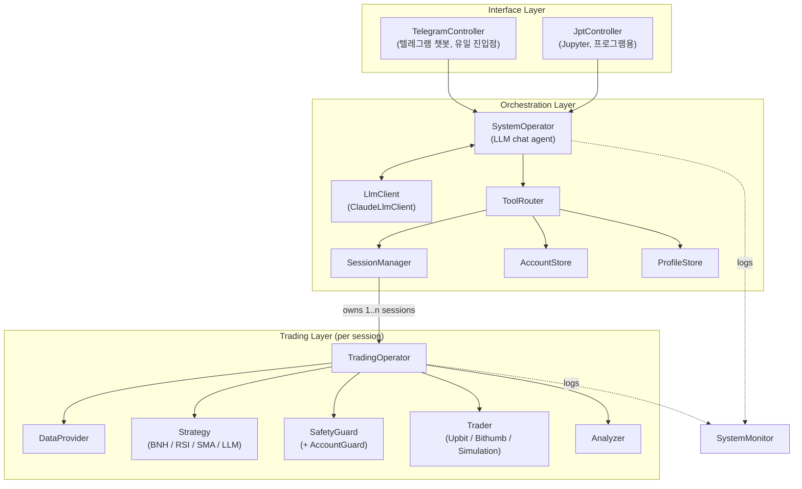
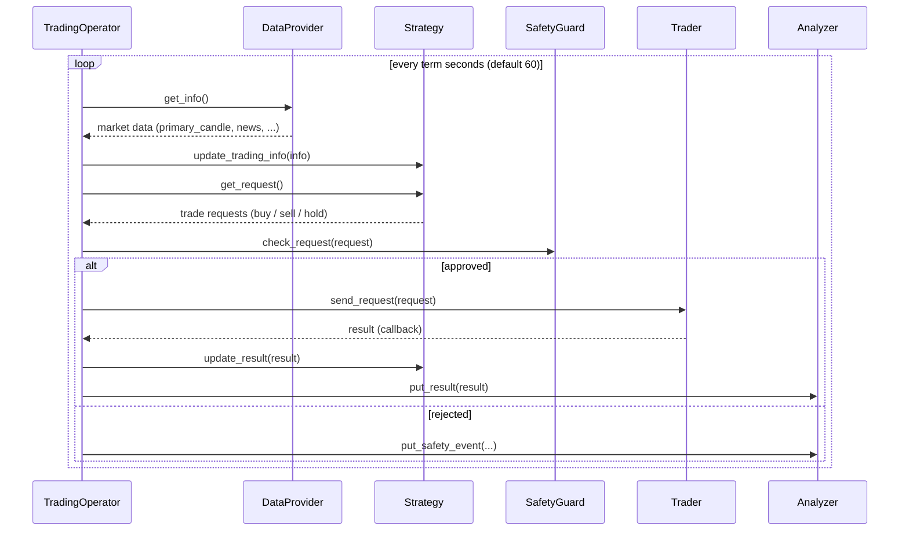

# 아키텍처

시스템은 2계층(two-layer) 구조입니다. 채팅 기반 LLM 에이전트(SystemOperator)가 오케스트레이션을 담당하고, 실제 매매는 세션별 고정 주기 루프(TradingOperator)가 수행합니다. SessionManager가 하나 이상의 세션을 병렬로 조율합니다.

| Layer | Module | Role |
|:---:|:---:|:---:|
| Interface Layer | TelegramController, JptController | 사용자 인터페이스 (텔레그램 챗봇 / Jupyter) |
| Orchestration Layer | SystemOperator, ToolRouter, LlmClient, SessionManager, AccountStore, ProfileStore | 채팅 기반 오케스트레이션, 세션·계좌·프로파일 관리 |
| Trading Layer | TradingOperator, DataProvider, Strategy, SafetyGuard, Trader, Analyzer | 세션별 고정 주기 매매 루프 |
| Monitoring | SystemMonitor | 모든 활동을 세션별로 태깅하여 독립 기록 |

- **SystemOperator** (`smtm/llm/system_operator.py`) — 채팅 기반 LLM 에이전트. 계좌 등록, 프로파일 관리, 세션 생성/시작/중지/비교를 Tool로 수행합니다. 직접 매매하지 않습니다.
- **SessionManager** (`smtm/session_manager.py`) — 모든 TradingSession(default 세션 + 채팅으로 생성한 세션)을 소유. 예산을 실제 계좌 잔고와 대조 검증하고 (계좌, 심볼) 중복 할당을 방지합니다.
- **TradingOperator** (`smtm/trading_operator.py`) — 세션당 1개. 고정 주기(term, 기본 60초)로 DataProvider → Strategy → SafetyGuard → Trader → Analyzer 루프를 실행합니다.
- **Strategy** (`smtm/strategy/`) — 교체 가능. StrategyFactory에 `BNH`(Buy & Hold), `RSI`, `SMA`, `LLM`(매 틱 LLM 판단 1회)이 등록되어 있습니다.
- **SafetyGuard** (`smtm/llm/safety_guard.py`) — 모든 주문 전에 거래 제한(최대 거래 금액, 일일 거래 횟수, 손실 비율 상한)을 검증합니다. 같은 계좌를 공유하는 세션 간에는 AccountGuard(`smtm/llm/account_guard.py`)가 계좌 단위 한도를 함께 적용합니다.
- **SystemMonitor** (`smtm/llm/system_monitor.py`) — 시장 데이터, 요청/결과, 안전 이벤트, LLM 사용량 등 모든 활동을 세션 이름으로 태깅하여 독립적으로 기록합니다. Analyzer(`smtm/analyzer.py`)는 그 위의 경량 분석기입니다.
- **AccountStore** (`smtm/account_store.py`) — 계좌 자격증명을 환경변수 *이름*으로만 저장합니다(키 원문 저장 금지). **ProfileStore** (`smtm/profile_store.py`) — 프로파일(전략 × 거래소 × 심볼 × 예산 × 계좌)을 `config/profiles/<name>.json`으로 관리합니다.
- **LlmClient** (`smtm/llm/llm_client.py`) — LLM 클라이언트 추상화. 현재 구현은 ClaudeLlmClient 하나입니다.

### Component Diagram

### Trading Loop Sequence Diagram

# Architecture

The system is split into two layers. A chat-based LLM agent (SystemOperator) handles orchestration, while the actual trading is done by a per-session fixed-interval loop (TradingOperator). A SessionManager coordinates one or more sessions in parallel.

| Layer | Module | Role |
|:---:|:---:|:---:|
| Interface Layer | TelegramController, JptController | User interface (Telegram chatbot / Jupyter) |
| Orchestration Layer | SystemOperator, ToolRouter, LlmClient, SessionManager, AccountStore, ProfileStore | Chat-based orchestration; session, account, and profile management |
| Trading Layer | TradingOperator, DataProvider, Strategy, SafetyGuard, Trader, Analyzer | Per-session fixed-interval trading loop |
| Monitoring | SystemMonitor | Independently logs all activity, tagged by session |

- **SystemOperator** (`smtm/llm/system_operator.py`) — chat-based LLM agent; orchestrates account registration, profiles, and session lifecycle via Tools. It does not trade directly.
- **SessionManager** (`smtm/session_manager.py`) — owns all `TradingSession`s (the default session plus any created via chat); validates budgets against real account balances and prevents duplicate (account, symbol) allocations.
- **TradingOperator** (`smtm/trading_operator.py`) — one per session; runs the fixed-interval (term, default 60s) loop: DataProvider → Strategy → SafetyGuard → Trader → Analyzer.
- **Strategy** (`smtm/strategy/`) — pluggable. The StrategyFactory registers `BNH` (Buy & Hold), `RSI`, `SMA`, and `LLM` (a single LLM judgment per tick).
- **SafetyGuard** (`smtm/llm/safety_guard.py`) — validates every order against trading limits (max trade amount, daily trade count, loss ratio ceiling) before execution. Sessions sharing an account are additionally capped by an account-level AccountGuard (`smtm/llm/account_guard.py`).
- **SystemMonitor** (`smtm/llm/system_monitor.py`) — independently records all activity (market data, requests/results, safety events, LLM usage), tagged by session name. Analyzer (`smtm/analyzer.py`) is a lightweight analyzer on top of it.
- **AccountStore** (`smtm/account_store.py`) — stores account credentials by environment-variable *names* only (never raw keys). **ProfileStore** (`smtm/profile_store.py`) — manages profiles (strategy × exchange × symbol × budget × account) as `config/profiles/<name>.json`.
- **LlmClient** (`smtm/llm/llm_client.py`) — LLM client abstraction; ClaudeLlmClient is the only implementation for now.

See the component and sequence diagrams above.
